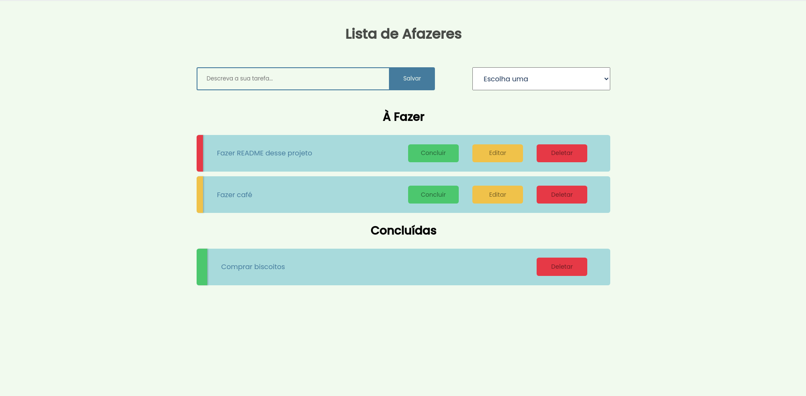

# Task Manager

Projeto Feito para aplicação de conhecimento sobre PHP vanilha.

O layout produzido foi feito por mim mesmo Marlon Symczecym, e a parte da programação também.

O projeto foi feito para treinar conceitos que foram apresentados por mim via o curso de VueJs da empresa Origamid.
Tenho estudado bastante, e após o ultimo projeto que foi feito guiado pelo professor, decidi fazer um projeto autoral, passando por todas as dificuldades que se passaria fazendo algo sozinho.
E foi o que aconteceu, vários bugs, mas que consegui resolver, e deixar o projeto redondo

## FUNCIONALIDADES

O gerenciador de tarefas possui as seguintes funcionalidades:

- Adicionar uma tarefa
- Escolher entre urgente e não urgente
- Validação de quantos caracteres foram inseridos, se for abaixo de 5 não deixará cadastrar
- Edição de tarefa
- Botão de concluir tarefa
- Botão de exclusão de tarefa à fazer
- Botão de conclusão de tarefa
- Área mostrando as tarefas à fazer, e as concluídas
- Projeto responsivo

## Ferramentas

No projeto foi utilizado:

- CSS3
- HTML5
- VueJs

# RESULTADO

## AUTOR

Marlon Symczecym

**Linkedin:** [Marlon Symczecym](https://www.linkedin.com/in/marlonsymczecym/)
